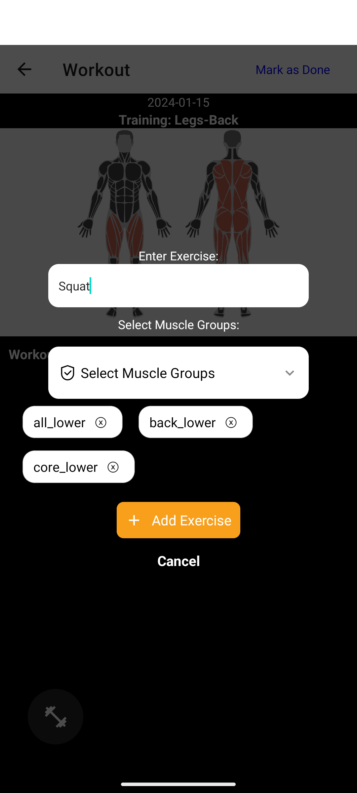
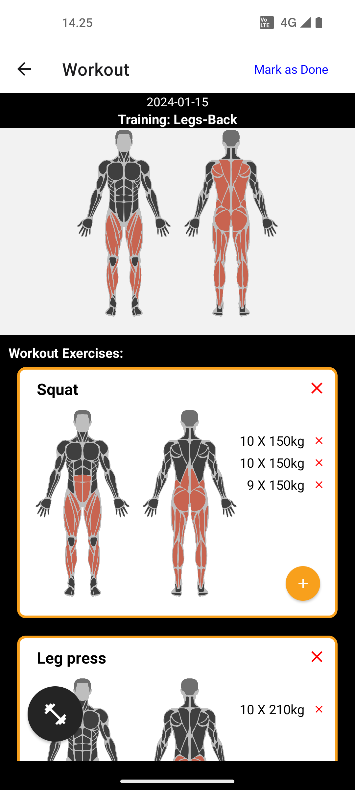
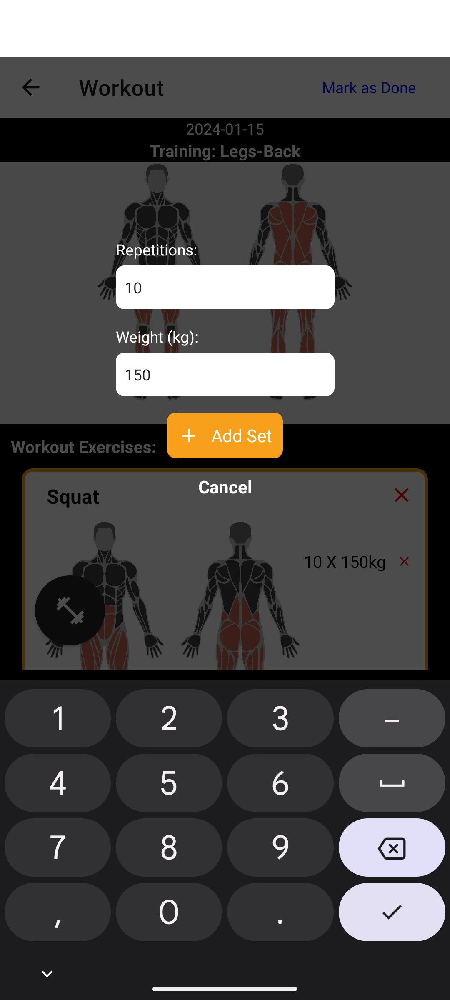
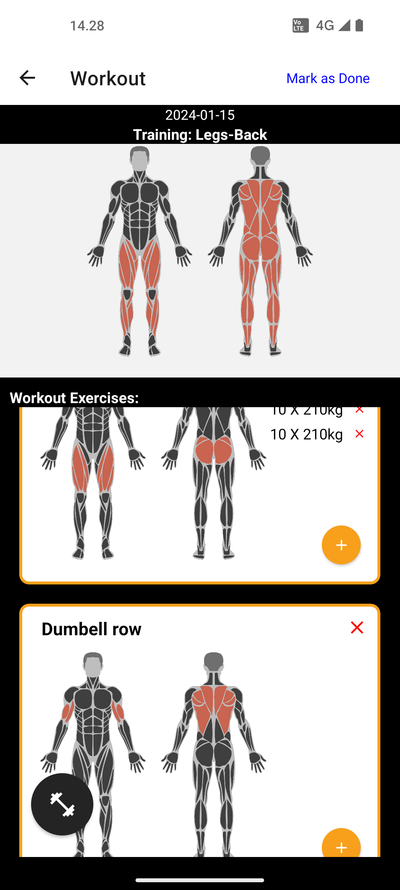

# Exercise App

**Note:** This project is still under development.

## Overview

The Exerciser App is a mobile application created with React Native. It serves as a training app that helps users keep track of their exercises and results. The app is designed to assist users in organizing and managing their workout routines.

## Features

- **Training Management:** Create, view, and delete training sessions.
- **Exercise Tracking:** Record exercises, including sets and repetitions.
- **Muscle Group Visualization:** Visual representation of muscle groups targeted in each training.
- **Date Tracking:** Track the date when a training session was added.

## Dependencies

This project uses the following dependencies:

- **SQLite:**
- **Muscle Group Image Generator by Merten (RapidAPI):** Fetches muscle group images based on exercise data.

## Screenshots

   
